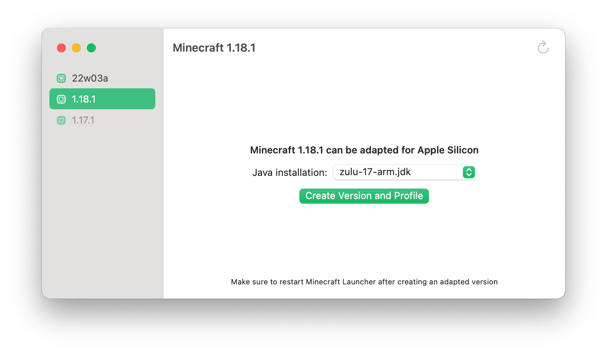

# Minecraft Silicon

A dead simple utility to generate Apple Silicon-native Minecraft Launcher profiles. No logins, no tricky options, just high-performance Minecraft.

Supports Minecraft 1.18 and up.

## How does it work?

Minecraft Silicon patches installed Minecraft versions to use official arm64 LWJGL libraries, and a native version of Java-Objective-C-Bridge.

It generates a launcher profile, so that Apple Silicon versions of Minecraft can be launched directly from Minecraft Launcher.

## How can I get it?

[Grab the latest version from GitHub releases.](https://github.com/tagavari/minecraft-silicon/releases/latest)
